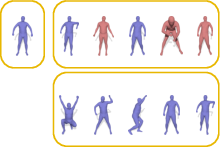
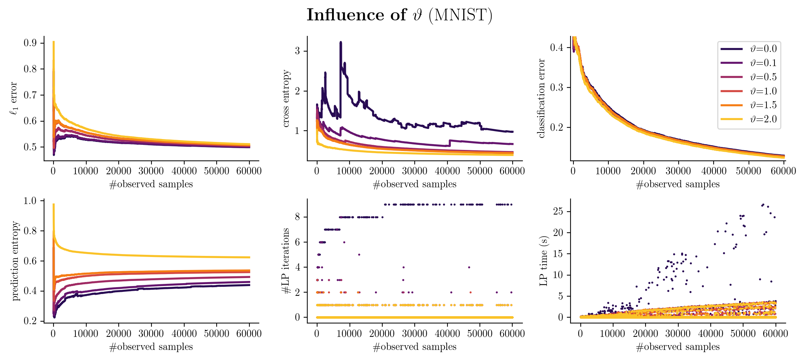
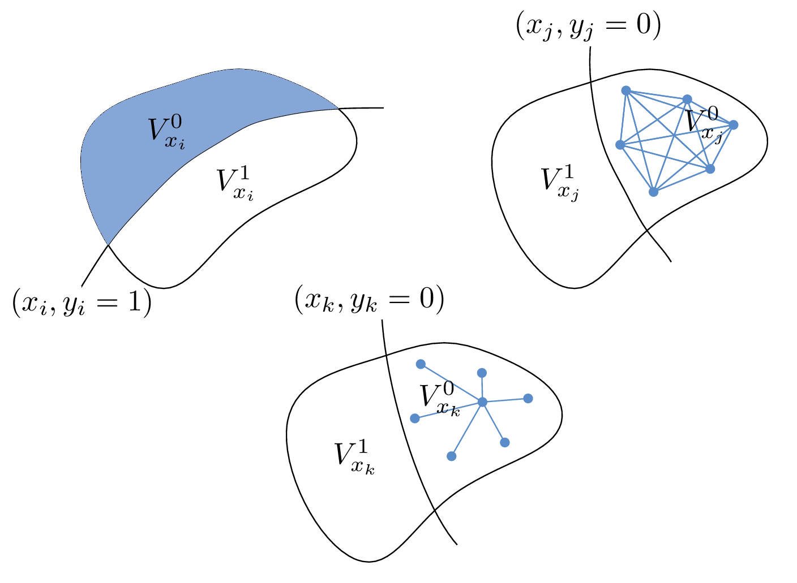
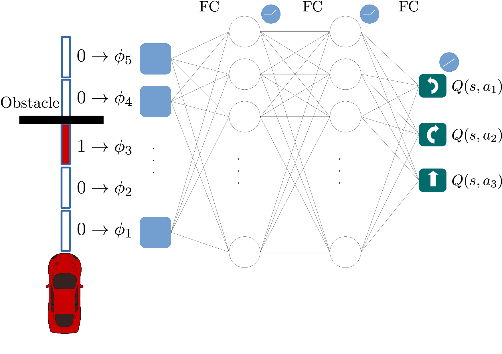
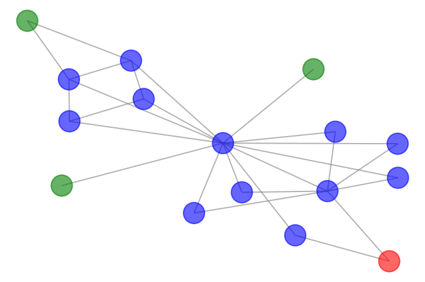

## Conference Papers

|  | **Non-Rigid 3D Shape Retrieval via Large Margin Nearest Neighbor Embedding** (*Ioannis Chiotellis* and Rudolph Triebel and Thomas Windheuser and Daniel Cremers), In European Conference on Computer Vision (ECCV), 2016. [(pdf)](https://vision.in.tum.de/_media/spezial/bib/chiotellis2016csdlmnn.pdf) [(code)](https://github.com/tum-vision/csd_lmnn) |
|  | **Incremental Semi-Supervised Learning from Streams for Object Classification** (*Ioannis Chiotellis*, Franziska Zimmermann, Daniel Cremers and Rudolph Triebel), In International Conference on Intelligent Robots and Systems (IROS), 2018. [(pdf)](https://vision.in.tum.de/_media/spezial/bib/chiotellis2018ilp.pdf) [(code)](https://github.com/johny-c/incremental-label-propagation) |
|  | **Effective Version Space Reduction for Convolutional Neural Networks** (Jiayu Liu, *Ioannis Chiotellis*, Rudolph Triebel and Daniel Cremers), In European Conference on Machine Learning and Data Mining (ECML-PKDD), 2020. [(arxiv)](https://arxiv.org/abs/2006.12456) |

  

## Workshop Papers

|  | **Learning to Drive using Inverse Reinforcement Learning and Deep Q-Networks** (Sahand Sharifzadeh, *Ioannis Chiotellis*, Rudolph Triebel and Daniel Cremers), Workshop on “Deep Learning for Action and Interaction” (NIPS), 2016. [(arxiv)](https://arxiv.org/abs/1612.03653) |

  

## Preprints

|  | **Neural Online Graph Exploration** (*Ioannis Chiotellis* and Daniel Cremers), 2020. [(arxiv)](https://arxiv.org/abs/2012.03345) [(code)](https://github.com/johny-c/noge) |

